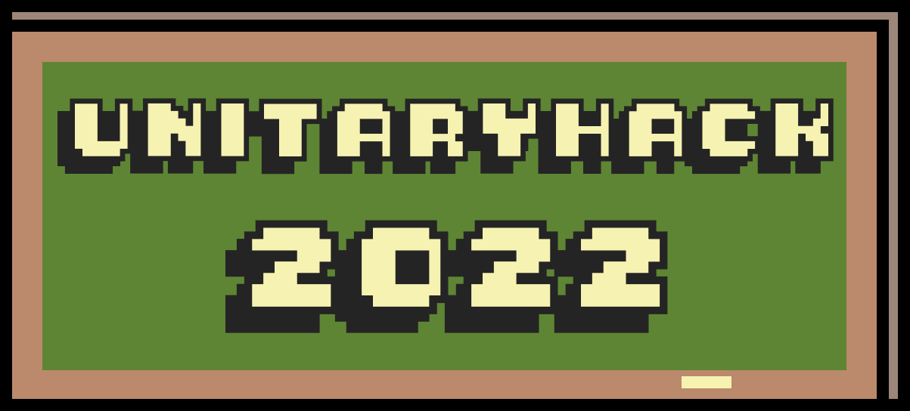

<figure>

<figcaption style="max-width: 60%;
        height: auto; margin: auto;
  display: block;font-size:.8em">
</figcaption>
</figure>

### [Unitary Fund](https://unitary.fund) is proud to host unitaryhack 2022, a quantum open source hackathon with SWAG and BOUNTIES on **June 3-17th**!

- 💰 Over 8,000 USD in bounties for resolving tagged issues in [participating quantum open source projects](https://unitaryhack.dev/projects/).

- 💿 Digital swag for all participants that successfully make Pull Requests (PR)s

- 🎁 Random participants that make at least 1 **quality** Pull Request (PR)s to a participating open source project got a [swag pack in the mail!*](https://unitaryhack.dev/rules)

<!-- <button style="max-width: 60%;height: auto; margin: auto;display: block;background-color:#ffff00;border-width:0em;font:'Lucida Console', monospace, !default;font-size:2em;" type="button" onclick="location='https://unitaryhack.dev/signup'"><b>PRESS START</b>

and get hacking!
</button> -->

### Thanks to our supporters

- [Microsoft Azure Quantum](https://azure.microsoft.com/it-it/services/quantum/)
- [DoraHacks](https://dorahacks.io/)
- [Zapata Computing](https://www.zapatacomputing.com/)
- [Unitary Fund](https://unitary.fund/) and its members, including [IBM](https://www.ibm.com/quantum), [Accenture](https://www.accenture.com/us-en/services/technology/quantum-computing-services), [Xanadu](https://www.xanadu.ai/), [IonQ](https://ionq.com/), [Boston Consulting Group](https://www.bcg.com/), [Pasqal](https://pasqal.io/), [IQM](https://www.meetiqm.com/), [DoraHacks](https://dorahacks.io/), and [Agnostiq](https://agnostiq.ai/)

### Support future unitaryhacks 🙏
Would you like to help us support more contributors and projects? [Get in touch](mailto:info@unitary.fund?subject=[UnitaryHack]%20Supporting%20You) with us!

### Want your project to participate in unitaryhack2022?

We would love to support your quantum open source project by connecting eager hackers to issues you need help with!
Check out our [maintainer guide](https://unitaryhack.dev/project-guide/)
## Stay tuned for details on the next unitaryhack!

You can find some tips on how to prepare for the hackathon the next event in our [hacker guide](https://unitaryhack.dev/hackers) as well as the [hackathon rules](https://unitaryhack.dev/rules). You can always ask questions of the Unitary Fund team on our [Discord](http://discord.unitary.fund), and make sure to check out [our code of conduct](CODE_OF_CONDUCT.md).

## 🚀 Local website development

Want to help improve the unitaryhack website?
The website is built with [11ty](https://www.11ty.dev/) and hosted on GitHub Pages.
The [Fernfolio](https://fernfolio.netlify.app/) template was used to bootstrap the design.
Here are some basic local setup steps to get you started:
### Local environment
- Clone the repo locally `git clone https://github.com/unitaryfund/unitaryhackdev.git`
- Navigate to root folder `cd untitaryhack2022`
- Install the goods `npm install`
- Run it `npm start`
- You should now be able to see everything running on localhost:8080
- Make a Pull Request to add your changes to github. Once approved, an auto-deploy should be triggered 🎉

## 💻 Development Scripts

**`npm start`**

> Run 11ty with hot reload at localhost:8080

**`npm run build`**

> Generate minified production build

Checkout the Eleventy [Command Line Usage docs](https://www.11ty.dev/docs/usage/) for more options.
